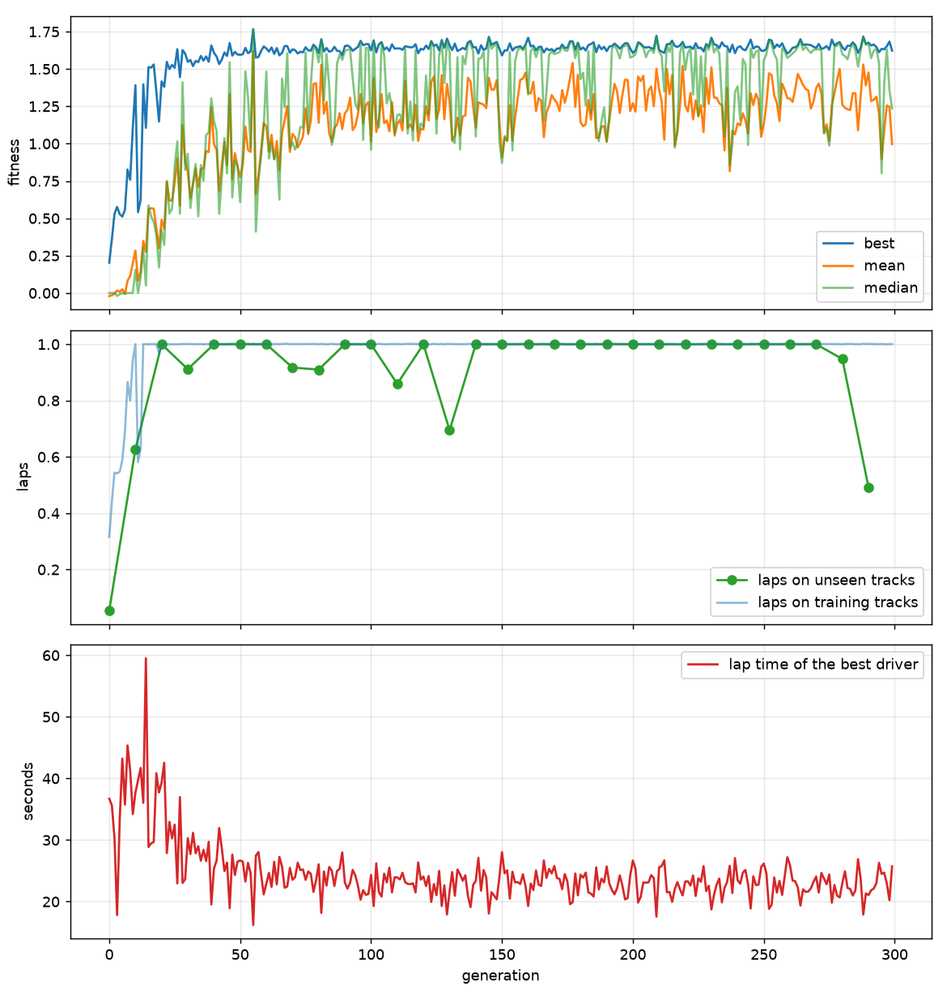

# racing-AI

Neuroevolution: 100 cars race with random weights, the best breed, and then repeat. I saw a video on evolving controllers by breeding and mutation, and I was struck by how closely it mirrors actual selection, and wanted to build it myself to see whether it really works. It does.

https://github.com/user-attachments/assets/68785b56-f2a4-4795-b63a-dcb6c13a6a68

## Design

**Inputs: 8.** Seven raycasts to the walls plus own speed.

**Brain: 470 weights.** `8 → 16 → 12 → 8 → 2`, `tanh` throughout. Outputs are
steering and pedal. The flattened parameter vector is the genome.

**Tracks: new every generation.** Six procedurally generated tracks per
generation, regenerated each time, so a layout is never seen twice. Seed ranges
are disjoint: training `[0, 10⁶)`, evaluation `[10⁶, ∞)`.

**Fitness.** Finishing is a gate, not a bonus: complete the lap and you score
`1 + time left`, fail and you score `distance covered − 0.1 · crash`. Every
finisher outranks every non-finisher, so lap time can never be bought with
risk. Across the six: `0.7 · mean + 0.3 · worst`, so consistency outranks peak
pace.

**Selection.** 5 elites copied untouched, remainder bred from the top 25 by
tournament (k=3), uniform crossover, gaussian mutation (rate 0.12, σ 0.25
decaying ×0.995 per generation to a floor of 0.03), plus 3 random immigrants
per generation against convergence.

**Champion.** Fitness is not comparable across generations — the tracks change
underneath it — so the saved genome is not the one that scored highest. Every
10 generations the leader is raced on held-out tracks and kept only if it beats
the record on tracks completed, with lap time as the tie-break.

**Physics.** Steering is rack-limited below ~4 u/s (150°/s) and grip-limited
above it (150 u/s² lateral), so turn radius scales with v². At the 110 u/s top
speed the car needs ~84 units of radius; generated corners go down to ~19.
Corners cannot be taken flat, which makes braking a decision the network has to
discover rather than a free parameter.

**Batching.** The whole population is one set of numpy arrays — one raycast
call, one forward pass, cars sliced out of the batch as they crash. ~8 s per
generation over six tracks on a laptop, which is what makes 300-generation runs
cheap enough to iterate on.

## Results



300 generations, population 100. Generation 0: 42% crash rate, best driver
completes 0.32 laps at a 37 s pace. Over the last 50 generations the field
finishes 82% of the time. The saved champion completes 40 out of 40 held-out
tracks without crashing, averaging 27.7 s a lap.

Validation laps (green) first reach 1.0 at generation 20, but only hold it from
140 on — as late as generation 130 the leader still drops to 0.69 on unseen
tracks, and the last two checks fall to 0.95 and 0.49. Completing the lap stops
separating anyone long before it stops being fragile. Lap time (red) is what the
rest buys: 37 s at generation 0, a 60 s worst at 14 before the field learns to
keep moving, a 23 s median from generation 100 — and then 200 more generations
for 0.2 s of it. Braking was not rewarded explicitly; it emerged because the v²
grip limit left no alternative through a hairpin.

The gate has a cost. Against a plain weighted sum the field crashes about three
times as often (9.4% vs 3.3%) but times out less — with no partial credit for
crawling, a driver may as well commit. Lap time came out the same either way:
tournament selection only reads the ranking, and both objectives rank finishers
by time.

## Reproducibility

`live.py` and `train.py` share one `Trainer`; a test asserts that a windowed
run and a headless run from the same seed produce byte-identical populations.
`--resume` restores the RNG stream, so a resumed run continues the same
trajectory. 112 tests.

## Usage

```bash
uv sync
uv run racing watch          # trained drivers on an unseen track
uv run racing train --live   # evolve in a window
uv run racing train          # headless, several times faster
uv run racing train --resume
uv run racing play           # drive it yourself, arrow keys
uv run racing demo           # generation zero, untrained
uv run racing eval --tracks 20
uv run pytest
```

Live keys: `SPACE` pause, `F` skip generation, `V` render off, `L`/`TAB` follow
leader / pick car, `C` camera, `+`/`-` speed, `ESC` stop and save. Checkpoints
in `checkpoints/`: `latest.npz` per generation, a snapshot every 25,
`history.csv`, `training_curve.png`.

Flags: `--population`, `--tracks`, `--hidden A B C`, `--rays`,
`--mutation-rate`, `--mutation-sigma`, `--crossover`, `--track-width`,
`--seed`.

## Layout

```
src/racing_ai/
  cli.py         entry point
  track.py       procedural track generation from a seed
  env.py         physics, collisions, laps, fitness
  sensors.py     vectorised raycasting
  network.py     the MLP, whole population at a time
  ga.py          selection, crossover, mutation
  trainer.py     one generation: race, score, breed, checkpoint
  train.py       training command
  live.py        training with a window
  render.py      race viewer and network diagram
  watch.py       viewer / manual driving
  evaluate.py    scoring on held-out tracks
  checkpoint.py  save, resume, history
```

MIT License.
